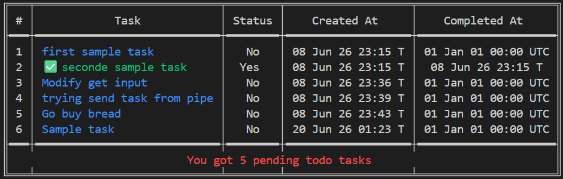
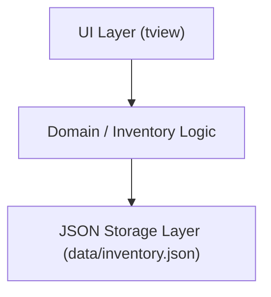
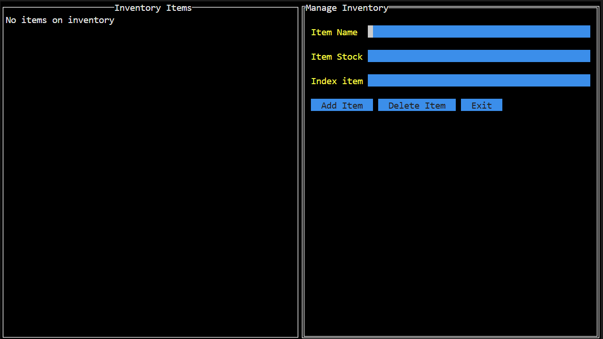
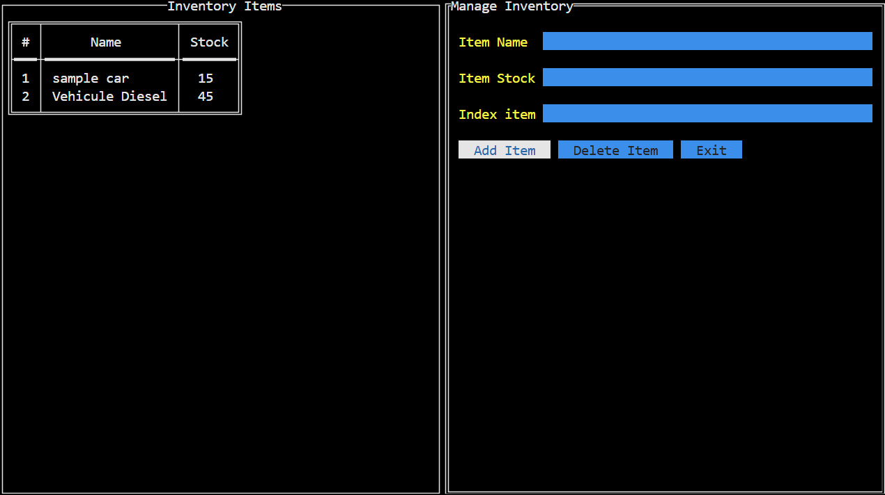
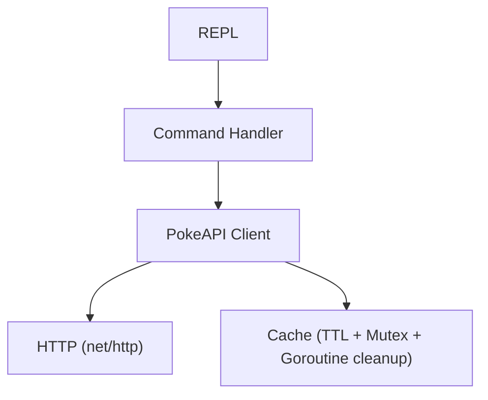
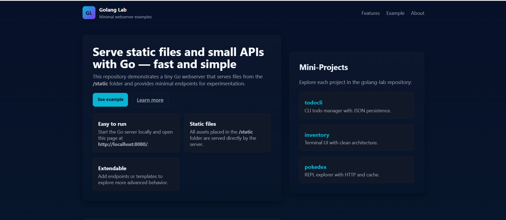

# 🐹 golang-lab

A hands-on learning repository for experimenting with **Go (Golang)**. This project is a structured collection of small, focused mini-projects built to explore core language concepts, standard library usage, concurrency patterns, networking, and backend development practices in Go.

> **Goal:** Learn Go by building real, working systems — not just reading documentation.

---

##  Skills Practiced

* Go fundamentals (structs, interfaces, methods)
* Package design & project structuring
* Clean architecture principles (SRP, separation of concerns)
* CLI and REPL application design
* Terminal UI (TUI) development
* JSON serialization & file persistence
* HTTP clients & REST API integration
* Concurrency (goroutines, mutexes, tickers)
* In-memory caching & TTL strategies
* Basic system design thinking

---

##  Repository Structure

```
golang-lab/
├── todocli/        # CLI Todo Manager (JSON persistence)
├── inventory/      # TUI Inventory Manager (Clean Architecture)
├── pokedex/        # REPL-based PokeAPI explorer (HTTP + cache)
├── webserver/      # Static file server with project pages
└── README.md
```

---

##  Mini-Projects

## 1. todocli — CLI Todo Manager

A command-line todo application demonstrating idiomatic Go, file persistence, and CLI flag handling.

### Features

* Add todos
* List todos
* Mark todos as completed
* Delete todos
* Persistent storage (`todos.json`)
* Pipe input support

### Concepts

* Structs & method receivers
* Pointer semantics
* Slice manipulation
* JSON encoding/decoding
* File I/O
* CLI flags (`flag` package)
* Error handling

### Usage

```bash
cd todocli

go run ./cmd/todo -list
go run ./cmd/todo -add "Buy groceries"
go run ./cmd/todo -complete 1
go run ./cmd/todo -delete 1
```

Pipe input:

```bash
echo "Buy groceries" | go run ./cmd/todo -add
```

### Screenshot



---

## 2. inventory — Terminal Inventory Manager (TUI)

A terminal UI application built using a layered architecture to manage stock items.

### Architecture



### Features

* View inventory in table format
* Add items with quantity
* Delete items by index
* Persistent storage (`data/inventory.json`)

### Concepts

* Clean architecture
* Single Responsibility Principle
* Package separation (`internal/`)
* TUI development with `tview`
* Table rendering
* File-based persistence

### Structure

```
inventory/
├── cmd/              # Entry point
├── data/             # JSON storage
└── internal/
    ├── inventory/    # Core domain logic
    └── ui/           # TUI layer
```

### Run

```bash
cd inventory
go run ./cmd
```

### Screenshots




---

## 3. pokedex — REPL PokeAPI Explorer

An interactive CLI REPL that explores Pokémon data using the public PokeAPI.

### Architecture



### Features

* Explore location areas
* List Pokémon in areas
* Catch Pokémon (probability-based)
* Inspect caught Pokémon
* Local Pokédex storage
* Paginated navigation

### Commands

```
help
map
mapback
explore <area>
catch <pokemon>
pokedex
inspect <pokemon>
exit
```

### Concepts

* HTTP client usage (`net/http`)
* JSON unmarshalling
* Goroutines (background cache cleanup)
* Mutex synchronization (`sync.RWMutex`)
* TTL cache design
* REPL design pattern
* API integration

### Run

```bash
cd pokedex
go run .
```

---

## 4. webserver — Static File Server

A minimal HTTP server serving static files from a `/static` folder, with project documentation pages for all golang-lab mini-projects.

### Features

* Serve static HTML pages from `/static`
* Project detail pages for each golang-lab mini-project
* Landing page with project grid and quick-start guide
* About page with repository overview

### Concepts

* HTTP server with `net/http.FileServer`
* Static file serving
* Clean HTML structure and styling
* Simple routing for project documentation

### Structure

```
webserver/
├── server.go       # HTTP server entry point
└── static/
    ├── index.html     # Landing page with project grid
    ├── about.html     # Repository information
    ├── todocli.html   # todocli project page
    ├── inventory.html # Inventory project page
    └── pokedex.html   # Pokedex project page
```

### Run

```bash
cd webserver
go run server.go
```

Then open `http://localhost:8080/` in your browser.

### Screenshot



### Why it matters

This project demonstrates how to use Go's standard library to serve static files and create a simple web interface for documenting other projects. Each project has a dedicated page accessible from the homepage grid.

---

##  Roadmap

### Completed

* CLI applications
* JSON persistence
* HTTP clients
* HTTP servers (net/http)
* Concurrency basics
* Mutex usage
* TTL cache design
* Static file serving

### In Progress

* Testing strategies (table-driven tests)
* Context usage in Go

### Planned

* Middleware design
* Database integration (SQL / GORM)
* Worker pools
* Channels & select patterns
* gRPC services
* Authentication systems

---

##  Learning Journey

### todocli

* CLI design
* Struct-based modeling
* File persistence

### inventory

* Clean architecture
* TUI development
* Layer separation

### pokedex

* HTTP APIs
* Concurrency
* Cache systems
* REPL design

### webserver

* Static file serving
* Web documentation
* Simple HTTP routing

---

## 🛠 Prerequisites

* Go 1.21+
* Basic terminal usage

Check version:

```bash
go version
```

---

##  Running Tests

```bash
go test ./...
```

Coverage:

```bash
go test -cover ./...
```

---

##  Resources

* https://go.dev/tour/
* https://go.dev/doc/effective_go
* https://gobyexample.com/
* https://pkg.go.dev/std

---

##  License

MIT License